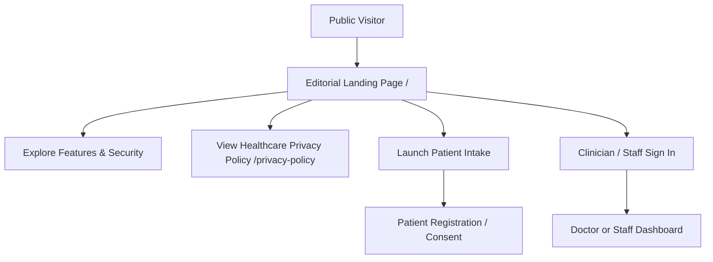
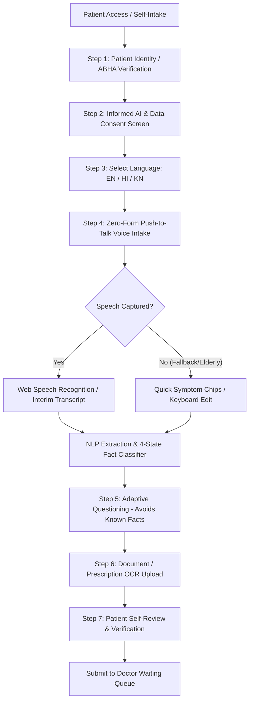
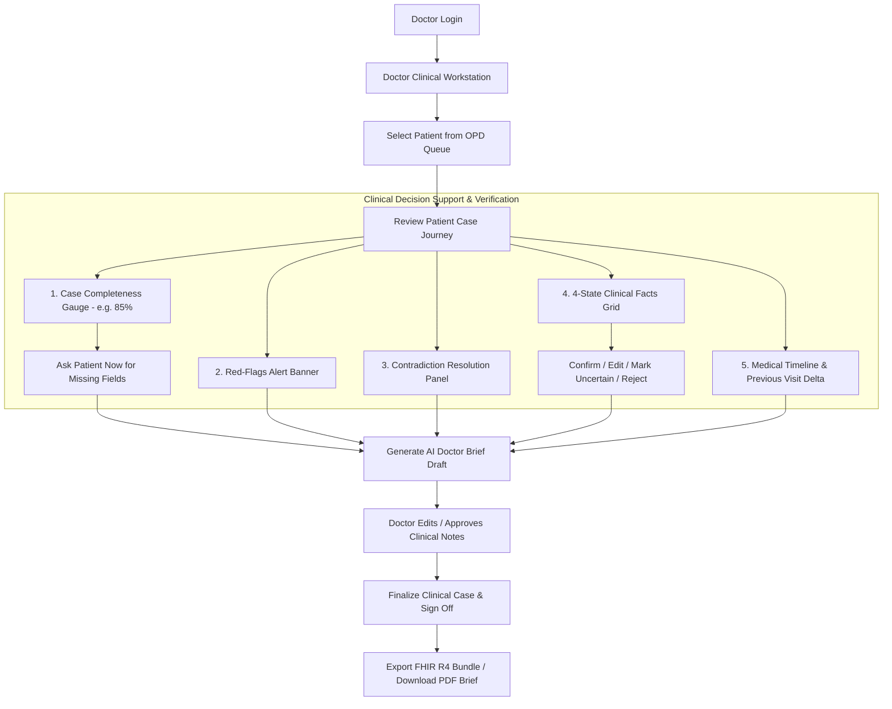
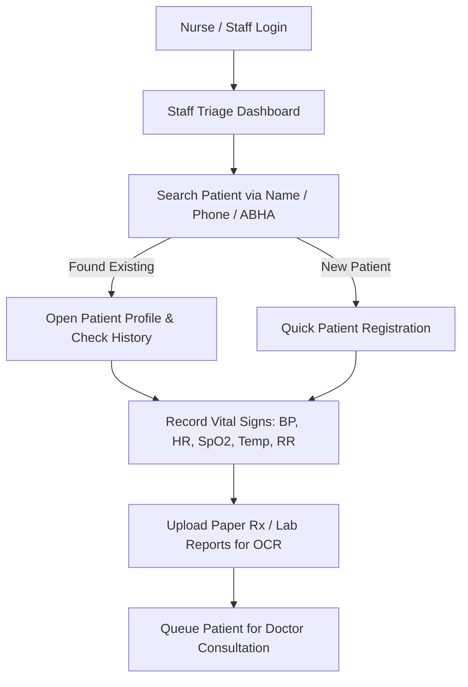
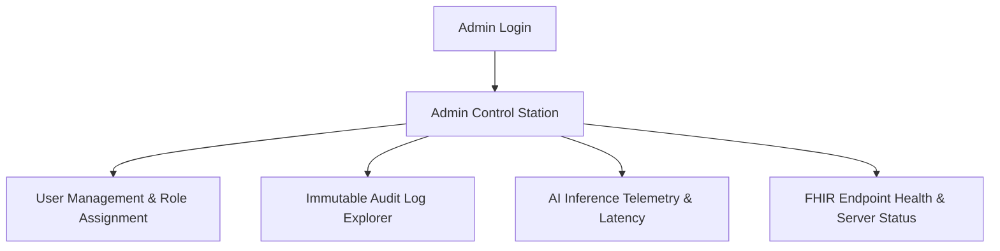
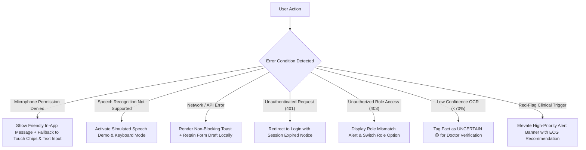

# Application Flow Document (APP_FLOW.md)
## AI-Powered Patient Case-Taking & Clinical Intelligence Platform (Pranabyte)

---

## 1. End-to-End System Role Flows

### 1.1. Public User / Landing Page Flow

---

### 1.2. Patient Spoken Case-Taking Flow

---

### 1.3. Doctor Clinical Review & Verification Flow

---

### 1.4. Hospital Staff / Nurse Triage Flow

---

### 1.5. System Administrator Flow

---

## 2. Error & Exception Handling Flows

