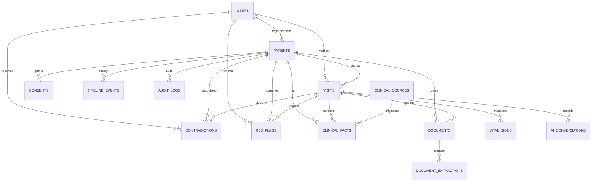

# Backend Schema & Database Specification (BACKEND_SCHEMA.md)
## AI-Powered Patient Case-Taking & Clinical Intelligence Platform (Pranabyte)

---

## 1. Entity-Relationship Diagram (Mermaid)

---

## 2. Table Specifications

### 2.1. `users`
System accounts and authentication.
- `id` (VARCHAR(64), PK): Unique UUID
- `email` (VARCHAR(255), UNIQUE, NOT NULL, INDEX): User login email
- `hashed_password` (VARCHAR(255), NOT NULL): Bcrypt hashed secret
- `full_name` (VARCHAR(255), NOT NULL): Display name
- `role` (VARCHAR(32), NOT NULL, DEFAULT 'patient'): `patient`, `doctor`, `nurse`, `staff`, `admin`
- `is_active` (BOOLEAN, DEFAULT TRUE): Account status flag
- `created_at` (DATETIME, DEFAULT CURRENT_TIMESTAMP)

### 2.2. `patients`
Core patient demographic & identity profile.
- `id` (VARCHAR(64), PK): Unique UUID
- `user_id` (VARCHAR(64), FK -> users.id, NULLABLE): Optional patient account link
- `patient_id_display` (VARCHAR(32), UNIQUE, INDEX): e.g. `PAT-DEMO-001`
- `name` (VARCHAR(255), NOT NULL): Full legal name
- `age` (INTEGER, NOT NULL): Age in years
- `sex` (VARCHAR(16), NOT NULL): `Male`, `Female`, `Other`
- `phone` (VARCHAR(32), NOT NULL): Primary contact number
- `abha_id` (VARCHAR(64), NULLABLE): Indian ABDM Health ID (e.g. `91-8273-9912-0041`)
- `is_existing` (BOOLEAN, DEFAULT FALSE): Returning vs new patient flag
- `created_at` (DATETIME, DEFAULT CURRENT_TIMESTAMP)
- `updated_at` (DATETIME, ON UPDATE CURRENT_TIMESTAMP)

### 2.3. `consents`
Informed patient consent records for AI case-taking & EHR processing.
- `id` (VARCHAR(64), PK): Unique UUID
- `patient_id` (VARCHAR(64), FK -> patients.id, NOT NULL)
- `consent_version` (VARCHAR(16), DEFAULT 'v1.0.0')
- `status` (VARCHAR(32), DEFAULT 'given'): `given`, `declined`, `revoked`
- `data_usage_disclosed` (TEXT, NOT NULL): Terms of data processing
- `ai_role_disclosed` (TEXT, NOT NULL): AI non-diagnostic disclosure
- `timestamp` (DATETIME, DEFAULT CURRENT_TIMESTAMP)

### 2.4. `visits`
Clinical consultation encounter session.
- `id` (VARCHAR(64), PK): Unique UUID
- `patient_id` (VARCHAR(64), FK -> patients.id, NOT NULL)
- `visit_number` (VARCHAR(32), NOT NULL): e.g. `VISIT-2026-904`
- `chief_complaint` (TEXT, NULLABLE): Primary symptom narrative
- `status` (VARCHAR(32), DEFAULT 'in_progress'): `in_progress`, `waiting_doctor`, `completed`, `flagged`
- `completeness_score` (INTEGER, DEFAULT 0): Percentage (0–100)
- `questions_asked_count` (INTEGER, DEFAULT 0): Adaptive questions asked
- `questions_avoided_count` (INTEGER, DEFAULT 0): Redundant questions avoided
- `ai_summary_draft` (TEXT, NULLABLE): Structured AI Doctor Brief
- `doctor_notes` (TEXT, NULLABLE): Clinician final notes
- `doctor_verified` (BOOLEAN, DEFAULT FALSE): Sign-off status
- `verified_by_doctor_id` (VARCHAR(64), FK -> users.id, NULLABLE)
- `verified_at` (DATETIME, NULLABLE)
- `patient_confirmed` (BOOLEAN, DEFAULT FALSE): Patient review status
- `patient_confirmed_at` (DATETIME, NULLABLE)
- `created_at` (DATETIME, DEFAULT CURRENT_TIMESTAMP)

### 2.5. `vital_signs`
Nursing triage physiological measurements.
- `id` (VARCHAR(64), PK): Unique UUID
- `visit_id` (VARCHAR(64), FK -> visits.id, NOT NULL)
- `bp_systolic` (INTEGER, NULLABLE): mmHg
- `bp_diastolic` (INTEGER, NULLABLE): mmHg
- `heart_rate` (INTEGER, NULLABLE): Beats per minute
- `spo2` (INTEGER, NULLABLE): Blood oxygen percentage
- `temperature` (FLOAT, NULLABLE): Fahrenheit
- `respiratory_rate` (INTEGER, NULLABLE): Breaths per minute
- `recorded_by` (VARCHAR(128), DEFAULT 'Nurse Triage')
- `recorded_at` (DATETIME, DEFAULT CURRENT_TIMESTAMP)

### 2.6. `clinical_facts`
Structured, evidence-linked clinical facts with 4-state classification.
- `id` (VARCHAR(64), PK): Unique UUID
- `patient_id` (VARCHAR(64), FK -> patients.id, NOT NULL)
- `visit_id` (VARCHAR(64), FK -> visits.id, NULLABLE)
- `category` (VARCHAR(64), NOT NULL): `chief_complaint`, `symptom`, `past_history`, `medication`, `allergy`, `lab_result`, `observation`
- `key_name` (VARCHAR(128), NOT NULL): Entity name (e.g. *Metformin 500mg*)
- `value` (TEXT, NOT NULL): Clinical value / dosage
- `status` (VARCHAR(32), DEFAULT 'CONFIRMED'): `CONFIRMED`, `DOCUMENTED`, `UNCERTAIN`, `CONFLICTING`, `REJECTED`
- `source_id` (VARCHAR(64), FK -> clinical_sources.id, NULLABLE)
- `source_citation` (TEXT, NULLABLE): Exact text or document page reference
- `confidence` (FLOAT, DEFAULT 1.0): 0.0 to 1.0 confidence score
- `doctor_verified` (BOOLEAN, DEFAULT FALSE): Clinician approval
- `doctor_action` (VARCHAR(32), NULLABLE): `confirmed`, `edited`, `rejected`, `marked_uncertain`
- `doctor_notes` (TEXT, NULLABLE)
- `created_at` (DATETIME, DEFAULT CURRENT_TIMESTAMP)

### 2.7. `contradictions`
Discrepancies between documented historical records and patient spoken statements.
- `id` (VARCHAR(64), PK): Unique UUID
- `patient_id` (VARCHAR(64), FK -> patients.id, NOT NULL)
- `visit_id` (VARCHAR(64), FK -> visits.id, NULLABLE)
- `category` (VARCHAR(64), NOT NULL): `medication_conflict`, `allergy_conflict`, `history_conflict`
- `title` (VARCHAR(255), NOT NULL)
- `source_a_description` (TEXT, NOT NULL): e.g. *Apollo Hospital Prescription (14-Aug-2026)*
- `source_a_value` (TEXT, NOT NULL): e.g. *Tab. Ecosprin 75mg OD Active*
- `source_b_description` (TEXT, NOT NULL): e.g. *Patient Spoken Intake (21-Sep-2026)*
- `source_b_value` (TEXT, NOT NULL): e.g. *Patient stopped taking aspirin 2 months ago*
- `status` (VARCHAR(32), DEFAULT 'ACTIVE'): `ACTIVE`, `RESOLVED_A`, `RESOLVED_B`, `RESOLVED_EDIT`, `DISMISSED`
- `resolution_notes` (TEXT, NULLABLE)
- `resolved_by_doctor_id` (VARCHAR(64), FK -> users.id, NULLABLE)
- `resolved_at` (DATETIME, NULLABLE)

### 2.8. `red_flags`
Safety rules screening for potentially urgent cardiopulmonary and drug toxicity risks.
- `id` (VARCHAR(64), PK): Unique UUID
- `patient_id` (VARCHAR(64), FK -> patients.id, NOT NULL)
- `visit_id` (VARCHAR(64), FK -> visits.id, NULLABLE)
- `rule_name` (VARCHAR(128), NOT NULL): e.g. `acute_coronary_cluster`
- `severity` (VARCHAR(32), DEFAULT 'HIGH'): `CRITICAL`, `HIGH`, `MODERATE`
- `title` (VARCHAR(255), NOT NULL)
- `trigger_criteria` (TEXT, NOT NULL)
- `recommendation` (TEXT, NOT NULL)
- `status` (VARCHAR(32), DEFAULT 'UNACKNOWLEDGED'): `UNACKNOWLEDGED`, `REVIEWED`, `ACKNOWLEDGED`, `DISMISSED`
- `reviewed_by_doctor_id` (VARCHAR(64), FK -> users.id, NULLABLE)
- `reviewed_at` (DATETIME, NULLABLE)

### 2.9. `audit_logs`
Immutable compliance audit trail tracking all PHI interactions.
- `id` (VARCHAR(64), PK): Unique UUID
- `patient_id` (VARCHAR(64), FK -> patients.id, NULLABLE)
- `visit_id` (VARCHAR(64), FK -> visits.id, NULLABLE)
- `actor_id` (VARCHAR(64), NULLABLE)
- `actor_name` (VARCHAR(255), NOT NULL)
- `actor_role` (VARCHAR(32), NOT NULL)
- `action` (VARCHAR(128), NOT NULL): e.g. `PATIENT_CASE_FINALIZED`
- `details` (TEXT, NULLABLE)
- `ip_address` (VARCHAR(64), NULLABLE)
- `timestamp` (DATETIME, DEFAULT CURRENT_TIMESTAMP)
